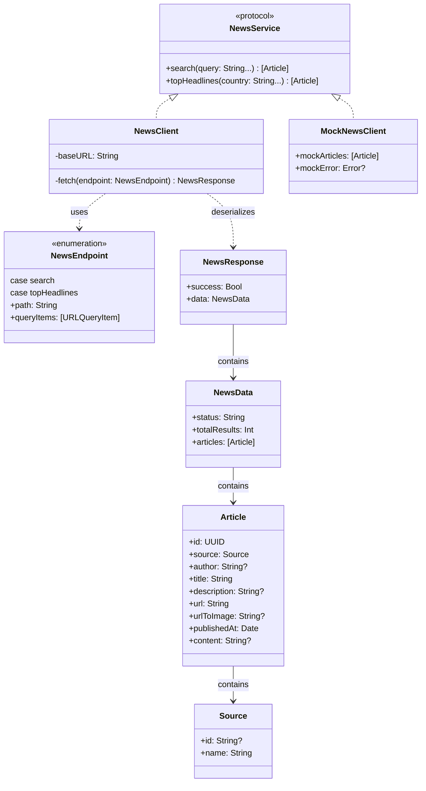

# System Diagram

Here is the system diagram of the current project structure:

```mermaid
classDiagram
    class NewsService {
        <<protocol>>
        +search(query: String...) [Article]
        +topHeadlines(country: String...) [Article]
    }

    class NewsClient {
        -baseURL: String
        -fetch(endpoint: NewsEndpoint) NewsResponse
    }

    class MockNewsClient {
        +mockArticles: [Article]
        +mockError: Error?
    }

    class NewsEndpoint {
        <<enumeration>>
        case search
        case topHeadlines
        +path: String
        +queryItems: [URLQueryItem]
    }

    class Article {
        +id: UUID
        +source: Source
        +author: String?
        +title: String
        +description: String?
        +url: String
        +urlToImage: String?
        +publishedAt: Date
        +content: String?
    }

    class Source {
        +id: String?
        +name: String
    }

    class NewsResponse {
        +success: Bool
        +data: NewsData
    }

    class NewsData {
        +status: String
        +totalResults: Int
        +articles: [Article]
    }

    NewsService <|.. NewsClient
    NewsService <|.. MockNewsClient
    NewsClient ..> NewsEndpoint : uses
    NewsClient ..> NewsResponse : deserializes
    NewsResponse --> NewsData : contains
    NewsData --> Article : contains
    Article --> Source : contains
```
